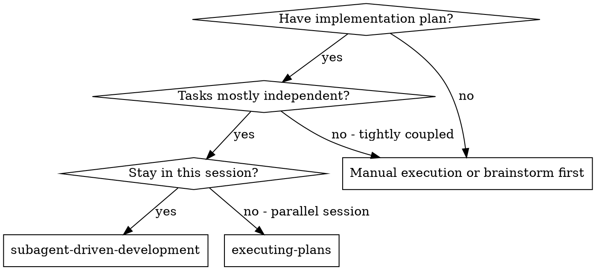
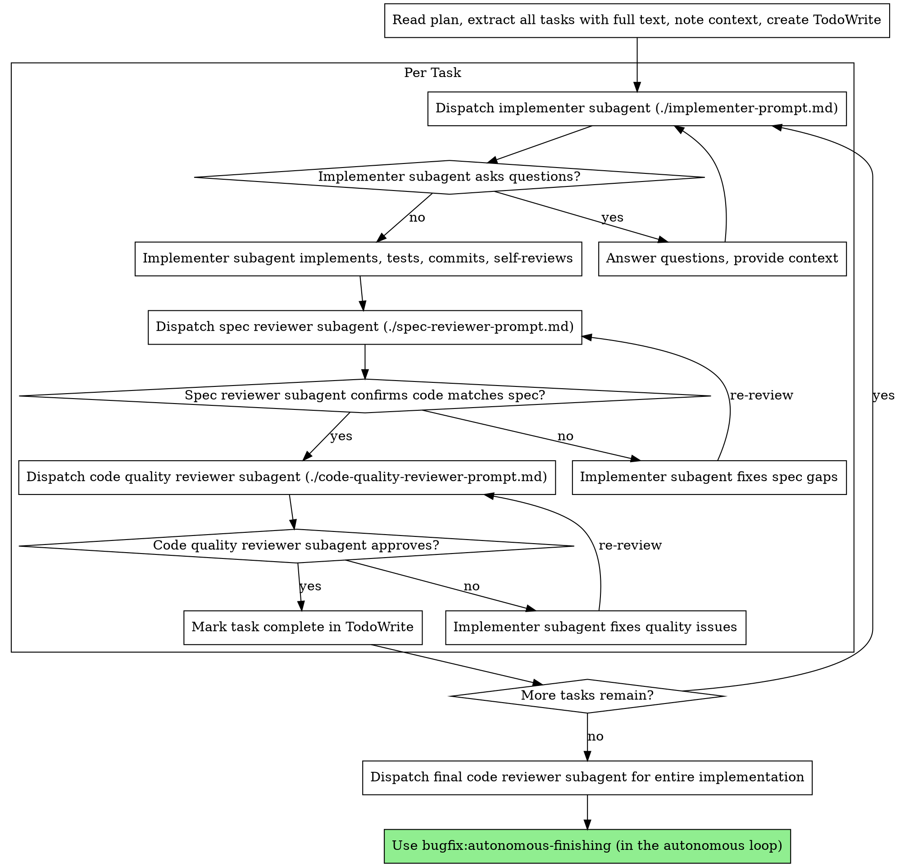

## State-file-first context

This skill is invoked by `bugfix:run-ticket` when `state.current_stage == "executing"`. Before doing any work:

1. Read `.bugfix/runs/<ticket-id>.json` and confirm `current_stage == "executing"`. If not, exit with an error.
2. cd into the worktree at `state.worktree_path` (created by `writing-plans` in the prior stage).
3. Read the plan at `state.plan_path` once and extract all tasks into working memory (per the upstream skill's pattern below).
4. Run the per-task loop (see body below) following the modifications in this skill that extend the upstream subagent-driven-development pattern.
5. After every task completes review-clean: set `state.current_stage = "finishing"`, exit.

If a task's reviews exhaust their retry budget, exit via `bugfix:block-and-comment(tech-failure)` per the per-task escalation below.

---


# Subagent-Driven Development

Execute plan by dispatching fresh subagent per task, with two-stage review after each: spec compliance review first, then code quality review.

**Why subagents:** You delegate tasks to specialized agents with isolated context. By precisely crafting their instructions and context, you ensure they stay focused and succeed at their task. They should never inherit your session's context or history — you construct exactly what they need. This also preserves your own context for coordination work.

**Core principle:** Fresh subagent per task + two-stage review (spec then quality) = high quality, fast iteration

## When to Use



**vs. Executing Plans (parallel session):**
- Same session (no context switch)
- Fresh subagent per task (no context pollution)
- Two-stage review after each task: spec compliance first, then code quality
- Faster iteration (no human-in-loop between tasks)

## The Process



## Model Selection

Use the least powerful model that can handle each role to conserve cost and increase speed.

**Mechanical implementation tasks** (isolated functions, clear specs, 1-2 files): use a fast, cheap model. Most implementation tasks are mechanical when the plan is well-specified.

**Integration and judgment tasks** (multi-file coordination, pattern matching, debugging): use a standard model.

**Architecture, design, and review tasks**: use the most capable available model.

**Task complexity signals:**
- Touches 1-2 files with a complete spec → cheap model
- Touches multiple files with integration concerns → standard model
- Requires design judgment or broad codebase understanding → most capable model


## Fresh-implementer-on-retry (mandatory)

When a spec-compliance review OR code-quality review fails for a task, the retry policy is non-negotiable. **Counter is per-mode** — `spec_review` and `code_quality_review` failures are tracked separately and Action escalation is evaluated per counter, NOT against a shared counter.

- **Action 1 (first failure of the same mode on the same task):** SAME implementer subagent fixes the issues (existing upstream behavior — see The Process diagram).
- **Action 2 (second failure of the same mode on the same task):** Dispatch a **NEW** implementer subagent using `bugfix/skills/_prompts/implementer-retry-prompt.md`. Substitute `<<<INSERT_VERDICT_HERE>>>` with the previous reviewer's verbatim verdict before dispatch. The dispatch includes a `model_hint` field set from `config.model_hints.implementer` (default: `opus`) so the host can route to a more capable model.
- **Action 3 (third failure of the same mode on the same task):** Exit via `bugfix:block-and-comment(tech-failure)` with both reviewers' verdicts attached as artifacts.

A task that has one spec-review failure and one code-quality failure is NOT at Action 2 — each counter is at 1 and Action 1 (same-implementer fix) applies to whichever review mode just failed.

Counter location: `state.retries.executing.task_<N>_<failure_mode>` where `<failure_mode>` is `spec_review` or `code_quality_review`. Each counter has its own budget: `config.retry_budgets.spec_review` (default 2) and `config.retry_budgets.code_quality_review` (default 2).

Read-modify-write the state file at each retry attempt:

```
# Pseudocode:
read .bugfix/runs/<ticket-id>.json -> state
state.retries.executing["task_${N}_${failure_mode}"] = (existing or 0) + 1
write state back
```

Two failed reviews of the same task is a strong signal the implementer has the wrong mental model; reusing the same sub-agent for a third attempt is wasteful and risks the same flaw.

## Typed reviewer agent

Per the upstream pattern, the code-quality reviewer is dispatched as the typed agent `bugfix:code-reviewer` (vendored from upstream; lives at `bugfix/agents/code-reviewer.md`). Spec-compliance review uses a fresh generic sub-agent with `bugfix/skills/_prompts/spec-reviewer-prompt.md`. Both reviewers run in isolated contexts — they never inherit the controller's session.


## Handling Implementer Status

Implementer subagents report one of four statuses. Handle each appropriately:

**DONE:** Proceed to spec compliance review.

**DONE_WITH_CONCERNS:** The implementer completed the work but flagged doubts. Read the concerns before proceeding. If the concerns are about correctness or scope, address them before review. If they're observations (e.g., "this file is getting large"), note them and proceed to review.

**NEEDS_CONTEXT:** The implementer needs information that wasn't provided. Provide the missing context and re-dispatch.

**BLOCKED:** The implementer cannot complete the task. Assess the blocker:
1. If it's a context problem, provide more context and re-dispatch with the same model
2. If the task requires more reasoning, re-dispatch with a more capable model
3. If the task is too large, break it into smaller pieces
4. If the plan itself is wrong, escalate to the human

**Never** ignore an escalation or force the same model to retry without changes. If the implementer said it's stuck, something needs to change.

## Prompt Templates

- `./implementer-prompt.md` - Dispatch implementer subagent
- `./spec-reviewer-prompt.md` - Dispatch spec compliance reviewer subagent
- `./code-quality-reviewer-prompt.md` - Dispatch code quality reviewer subagent

## Example Workflow

```
You: I'm using Subagent-Driven Development to execute this plan.

[Read plan file once: .bugfix/plans/feature-plan.md]
[Extract all 5 tasks with full text and context]
[Create TodoWrite with all tasks]

Task 1: Hook installation script

[Get Task 1 text and context (already extracted)]
[Dispatch implementation subagent with full task text + context]

Implementer: "Before I begin - should the hook be installed at user or system level?"

You: "User level (~/.config/superpowers/hooks/)"

Implementer: "Got it. Implementing now..."
[Later] Implementer:
  - Implemented install-hook command
  - Added tests, 5/5 passing
  - Self-review: Found I missed --force flag, added it
  - Committed

[Dispatch spec compliance reviewer]
Spec reviewer: ✅ Spec compliant - all requirements met, nothing extra

[Get git SHAs, dispatch code quality reviewer]
Code reviewer: Strengths: Good test coverage, clean. Issues: None. Approved.

[Mark Task 1 complete]

Task 2: Recovery modes

[Get Task 2 text and context (already extracted)]
[Dispatch implementation subagent with full task text + context]

Implementer: [No questions, proceeds]
Implementer:
  - Added verify/repair modes
  - 8/8 tests passing
  - Self-review: All good
  - Committed

[Dispatch spec compliance reviewer]
Spec reviewer: ❌ Issues:
  - Missing: Progress reporting (spec says "report every 100 items")
  - Extra: Added --json flag (not requested)

[Implementer fixes issues]
Implementer: Removed --json flag, added progress reporting

[Spec reviewer reviews again]
Spec reviewer: ✅ Spec compliant now

[Dispatch code quality reviewer]
Code reviewer: Strengths: Solid. Issues (Important): Magic number (100)

[Implementer fixes]
Implementer: Extracted PROGRESS_INTERVAL constant

[Code reviewer reviews again]
Code reviewer: ✅ Approved

[Mark Task 2 complete]

...

[After all tasks]
[Dispatch final code-reviewer]
Final reviewer: All requirements met, ready to merge

Done!
```

## Advantages

**vs. Manual execution:**
- Subagents follow TDD naturally
- Fresh context per task (no confusion)
- Parallel-safe (subagents don't interfere)
- Subagent can ask questions (before AND during work)

**vs. Executing Plans:**
- Same session (no handoff)
- Continuous progress (no waiting)
- Review checkpoints automatic

**Efficiency gains:**
- No file reading overhead (controller provides full text)
- Controller curates exactly what context is needed
- Subagent gets complete information upfront
- Questions surfaced before work begins (not after)

**Quality gates:**
- Self-review catches issues before handoff
- Two-stage review: spec compliance, then code quality
- Review loops ensure fixes actually work
- Spec compliance prevents over/under-building
- Code quality ensures implementation is well-built

**Cost:**
- More subagent invocations (implementer + 2 reviewers per task)
- Controller does more prep work (extracting all tasks upfront)
- Review loops add iterations
- But catches issues early (cheaper than debugging later)

## Red Flags

**Never:**
- Start implementation on main/master branch without explicit user consent
- Skip reviews (spec compliance OR code quality)
- Proceed with unfixed issues
- Dispatch multiple implementation subagents in parallel (conflicts)
- Make subagent read plan file (provide full text instead)
- Skip scene-setting context (subagent needs to understand where task fits)
- Ignore subagent questions (answer before letting them proceed)
- Accept "close enough" on spec compliance (spec reviewer found issues = not done)
- Skip review loops (reviewer found issues = implementer fixes = review again)
- Let implementer self-review replace actual review (both are needed)
- **Start code quality review before spec compliance is ✅** (wrong order)
- Move to next task while either review has open issues

**If subagent asks questions:**
- Answer clearly and completely
- Provide additional context if needed
- Don't rush them into implementation

**If reviewer finds issues:**
- Implementer (same subagent) fixes them
- Reviewer reviews again
- Repeat until approved
- Don't skip the re-review

**If subagent fails task:**
- Dispatch fix subagent with specific instructions
- Don't try to fix manually (context pollution)

## Integration

**Required workflow skills:**
- **bugfix:using-git-worktrees** - REQUIRED: Set up isolated workspace before starting
- **bugfix:writing-plans** - Creates the plan this skill executes
- **bugfix:requesting-code-review** - Code review template for reviewer subagents
- **bugfix:autonomous-finishing** - In the bugfix autonomous loop, this skill follows executing-plan as the next stage. For manual workflows outside the loop, you may use a different finishing pattern.

**Subagents should use:**
- **bugfix:test-driven-development** - Subagents follow TDD for each task

**Alternative workflow:**
- (note: bugfix does NOT ship a separate executing-plans plural variant — the loop's `bugfix:run-ticket` driver dispatches this skill directly)

## State writes after Task 1 (regression test)

Task 1 of every bug-fix plan creates the failing regression test (per `bugfix:writing-plans`'s `reproduce-bug-first` rule). When Task 1's implementer reports DONE and both reviews pass, record the test file path so downstream stages can find it.

**Source of truth: the plan declares the path explicitly.** `bugfix:writing-plans` requires Task 1 to include a leading `**Regression test file:** <path>` declaration line. The path is read from that declaration, NOT inferred from `git diff` — the diff heuristic was fragile when Task 1 touched multiple files (e.g., a new test in `tests/foo_test.py` AND an extension to `tests/conftest.py`).

1. Read `.bugfix/runs/<ticket-id>.json`.
2. Parse the Task 1 section of `state.plan_path` for a line matching `^\*\*Regression test file:\*\* (.+)$`. If absent: this is a plan-format error — exit via `bugfix:block-and-comment(tech-failure, reason="Task 1 missing Regression test file declaration")`. If multiple matches: take the first; warn in the event log.
3. Set `state.artifacts.regression_test_path = "<declared path>"`. Use a worktree-relative path so the value works across host filesystems.
4. Write state back. Continue to Task 2.

This field is consumed by `bugfix:autonomous-finishing` (PR body template references it), `bugfix:ci-watchdog` (fix sub-agent must not weaken this test), and `bugfix:pr-final-review` (advocate runs the regression test on both base and PR tip). If you skip this write, those downstream stages have no path to run the test from — silent breakage.

## State advance on completion

After all tasks complete (final code-reviewer subagent approves the full diff per the upstream flow):

1. Read `.bugfix/runs/<ticket-id>.json`, set `state.current_stage = "finishing"`, set `state.updated_at = <now>`, write back.
2. Emit `task_done` for the last task (with detail `{"task_number": N}`) via `bugfix/lib/events-append.sh`. Do NOT emit any finishing-stage events here — `autonomous-finishing` owns those.
3. Exit cleanly. `bugfix:run-ticket` will dispatch `bugfix:autonomous-finishing` on its next loop iteration.

## State writes (summary)

This stage writes the following fields across its lifetime:

- `state.artifacts.regression_test_path` — after Task 1 succeeds (see "State writes after Task 1" section).
- `state.retries.executing.task_<N>_spec_review` — incremented on each spec-reviewer failure per task. Counter is per-mode (spec_review vs code_quality_review) and per-task.
- `state.retries.executing.task_<N>_code_quality_review` — incremented on each code-quality reviewer failure per task. Same per-mode-per-task scope.
- `state.updated_at` — refreshed on every state write.
- `state.current_stage = "finishing"` — on completion of all tasks (see "State advance on completion" above).

Retry semantics are **same-mode-twice**, not any-mode-twice: a task with one spec_review failure and one code_quality_review failure has `retries.executing.task_N_spec_review = 1` AND `retries.executing.task_N_code_quality_review = 1`. Each counter is checked against its own budget independently. Action 3 ("block-and-comment") fires when the **per-mode** counter reaches its budget — NOT when their sum does.

## Events

Emitted via `bugfix/lib/events-append.sh ".bugfix/runs/<ticket-id>.events.log" <event> executing '<detail-json>'`:

- `task_started` — detail: `{"task_number": <int>}`. Before dispatching the implementer for that task.
- `task_spec_review_failed` — detail: `{"task_number": <int>, "attempt": <int>}`. After a spec-reviewer subagent reports issues.
- `task_code_quality_review_failed` — detail: `{"task_number": <int>, "attempt": <int>}`. After a code-quality reviewer reports issues.
- `task_done` — detail: `{"task_number": <int>}`. After both reviewers approve a task. The last `task_done` (for the final task) is emitted at "State advance on completion" above.

## Block-and-comment escalation paths (retry table)

| Failure | Action 1 | Action 2 | Action 3 |
|---|---|---|---|
| Sub-agent reports `NEEDS_CONTEXT` | Re-dispatch with more context | `bugfix:block-and-comment(tech-failure)` | — |
| Sub-agent reports `BLOCKED` (context) | Re-dispatch with more context | Re-dispatch with bigger model hint | `bugfix:block-and-comment(tech-failure)` |
| Sub-agent reports `BLOCKED` (reasoning) | Re-dispatch with bigger-model hint | — | `bugfix:block-and-comment(tech-failure)` |
| Spec reviewer flags issues | Same implementer fixes | **Fresh implementer** via `implementer-retry-prompt.md` + bigger model | `bugfix:block-and-comment(tech-failure)` |
| Code-quality reviewer flags issues | Same implementer fixes | **Fresh implementer**, bigger model | `bugfix:block-and-comment(tech-failure)` |

Retry budgets read from `config.retry_budgets.spec_review` (default 2) and `config.retry_budgets.code_quality_review` (default 2).
